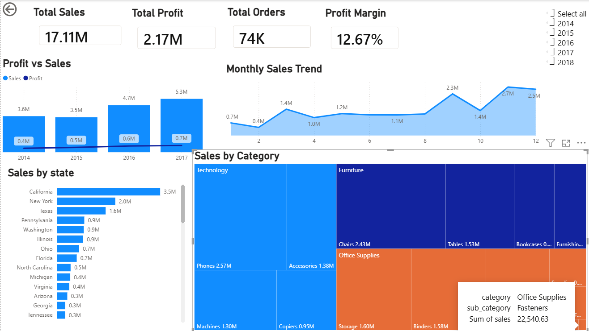

# Sales Analytics ETL Pipeline


An end-to-end Sales Analytics Data Engineering & Business Intelligence project built using Python, PostgreSQL, SQL, and Power BI.

This project demonstrates the complete analytics workflow:
- Data extraction and transformation using Python
- Loading data into PostgreSQL
- SQL-based analytics
- Building an interactive Power BI executive dashboard

---

# Project Overview

The goal of this project is to simulate a real-world sales analytics pipeline for retail data.

The pipeline:
1. Extracts raw sales data
2. Cleans and transforms the dataset
3. Loads the processed data into PostgreSQL
4. Performs SQL analytics
5. Visualizes business insights in Power BI

---

# Tech Stack

| Tool | Purpose |
|---|---|
| Python | ETL Pipeline |
| Pandas | Data Cleaning & Transformation |
| PostgreSQL | Database & Storage |
| SQLAlchemy | Database Connection |
| SQL | Analytics Queries |
| Power BI | Dashboard & Visualization |

---

# Project Architecture

```text
Raw CSV Data
     ↓
Python ETL Pipeline
     ↓
Data Cleaning & Transformation
     ↓
PostgreSQL Staging Table
     ↓
SQL Analytics Layer
     ↓
Power BI Dashboard
```

---

# ETL Pipeline

## Extract

The pipeline reads raw retail sales data from CSV files.

### Features
- Reads Superstore dataset
- Handles encoding issues
- Validates data structure

---

## Transform

Data transformation is performed using Pandas.

### Transformations Included
- Removed duplicate records
- Standardized column names
- Converted date columns to datetime format
- Created derived date columns
- Calculated profit margin

### Example Transformation

```python
df["profit_margin"] = (df["profit"] / df["sales"]) * 100
```

### Additional Calculated Fields
- `order_year`
- `order_month`
- `profit_margin`

---

## Load

Processed data is loaded into PostgreSQL using SQLAlchemy.

### Example Load Process

```python
df.to_sql(
    name="stg_orders",
    con=engine,
    if_exists='append',
    index=False
)
```

---

# Database Layer

## Staging Table

### `stg_orders`

Used as the staging layer for cleaned transactional sales data.

---

# Power BI Dashboard

The Power BI dashboard provides executive-level business insights and KPI reporting.

---

# Executive Dashboard Features

## KPI Cards
- Total Sales
- Total Profit
- Total Orders
- Profit Margin %

## Visualizations
- Profit vs Sales Analysis
- Monthly Sales Trend
- Sales by State
- Sales by Category

---

# Dashboard Preview

## Executive Overview



---

# Key Business Insights

- California generated the highest sales among all states
- Technology category contributed the largest share of revenue
- Sales showed strong growth trends across years
- Profitability varied across product categories and regions

---

# Example DAX Measure

## Profit Margin %

```DAX
Profit Margin % =
DIVIDE(
    SUM(stg_orders[profit]),
    SUM(stg_orders[sales]),
    0
) * 100
```

---

# Skills Demonstrated

## Data Engineering
- ETL pipeline development
- Data transformation
- PostgreSQL integration
- SQL analytics
- Data cleaning and preprocessing

## Business Intelligence
- Power BI dashboard development
- KPI reporting
- DAX measures
- Executive dashboard design
- Business performance analysis

---

# Repository Structure

```text
sales-analytics-etl-pipeline/
│
├── data/
│   ├── raw/
│   └── processed/
│
├── scripts/
│   ├── etl_pipeline.py
│   └── load_to_postgres.py
│
├── sql/
│   ├── analytics_queries.sql
│   └── views.sql
│
├── screenshots/
│   └── executive_dashboard.png
│
├── powerbi/
│   └── sales_dashboard.pbix
│
├── requirements.txt
└── README.md
```

---

# How to Run the Project

## 1. Clone Repository

```bash
git clone https://github.com/eslamhamzaoff/sales-analytics-etl-pipeline.git
```

---

## 2. Install Dependencies

```bash
pip install -r requirements.txt
```

---

## 3. Run ETL Pipeline

```bash
python etl_pipeline.py
```

---

## 4. Load Data into PostgreSQL

```bash
python load_to_postgres.py
```

---


- Power BI
- Data Analytics
- ETL Pipelines
